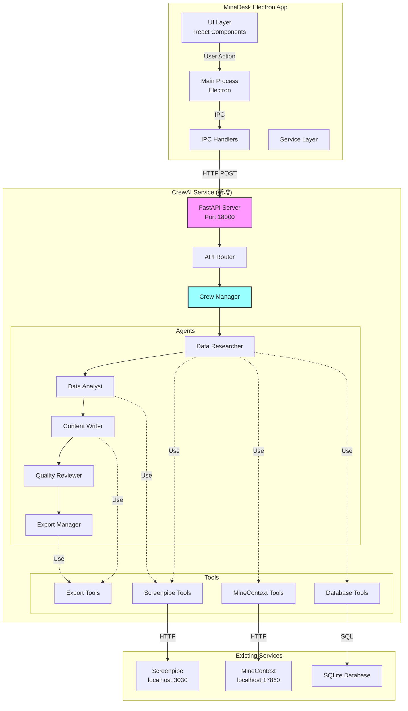
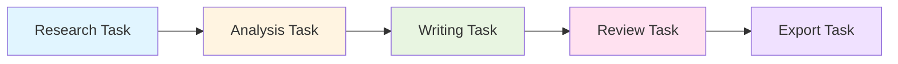
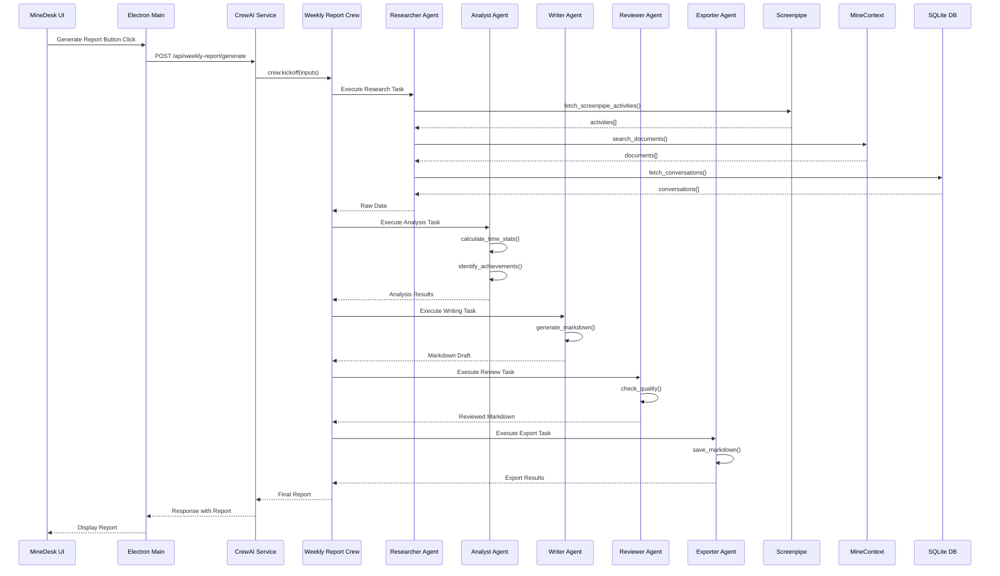

# Phase 3.1 - CrewAI 集成架构设计

**文档版本**: v1.0  
**创建日期**: 2025-11-04  
**阶段**: Architect (架构阶段)  
**状态**: ✅ 完成

---

## 📐 整体架构设计

### 系统架构图



---

## 🏗️ 核心模块设计

### 1. CrewAI Service 架构

#### 目录结构

```
crewai_service/
├── main.py                 # FastAPI 应用入口
├── config.py               # 配置管理
├── requirements.txt        # Python 依赖
│
├── api/
│   ├── __init__.py
│   ├── router.py          # API 路由
│   └── schemas.py         # Pydantic 模型
│
├── crews/
│   ├── __init__.py
│   ├── weekly_report.py   # 周报 Crew 定义
│   └── crew_manager.py    # Crew 管理器
│
├── agents/
│   ├── __init__.py
│   ├── researcher.py      # Agent 1: 数据研究员
│   ├── analyst.py         # Agent 2: 数据分析师
│   ├── writer.py          # Agent 3: 内容编写者
│   ├── reviewer.py        # Agent 4: 质量审核员
│   └── exporter.py        # Agent 5: 导出管理员
│
├── tools/
│   ├── __init__.py
│   ├── screenpipe_tools.py    # Screenpipe 工具
│   ├── minecontext_tools.py   # MineContext 工具
│   ├── database_tools.py      # 数据库工具
│   └── export_tools.py        # 导出工具
│
├── utils/
│   ├── __init__.py
│   ├── llm_config.py      # LLM 配置
│   ├── data_filter.py     # 数据过滤
│   └── logger.py          # 日志工具
│
└── tests/
    ├── test_agents.py
    ├── test_tools.py
    └── test_api.py
```

---

### 2. API 接口设计

#### 接口规范

**Base URL**: `http://localhost:18000`

#### 2.1 生成周报

```http
POST /api/weekly-report/generate
Content-Type: application/json

Request:
{
  "start_date": "2025-10-28",  // ISO 8601 格式
  "end_date": "2025-11-04",
  "options": {
    "language": "zh",           // zh | en
    "include_activities": true,
    "include_documents": true,
    "include_conversations": true,
    "template": "default"       // default | detailed | simple
  }
}

Response:
{
  "status": "success",
  "data": {
    "report_id": "report_20251104_123456",
    "content": "# 📊 Weekly Report...",  // Markdown content
    "metadata": {
      "generated_at": "2025-11-04T10:30:00Z",
      "duration_seconds": 85,
      "word_count": 1234,
      "sections": ["summary", "achievements", "time_distribution", ...]
    },
    "statistics": {
      "total_activities": 1543,
      "total_documents": 89,
      "total_time_hours": 42.5,
      "productivity_score": 0.85
    }
  }
}

Error Response:
{
  "status": "error",
  "message": "Failed to generate report",
  "error": {
    "code": "SERVICE_UNAVAILABLE",
    "detail": "Screenpipe service is not available",
    "timestamp": "2025-11-04T10:30:00Z"
  }
}
```

#### 2.2 获取生成进度

```http
GET /api/weekly-report/status/{report_id}

Response:
{
  "status": "in_progress",  // pending | in_progress | completed | failed
  "progress": 60,           // 0-100
  "current_step": "Analyzing data",
  "steps": [
    {"name": "Collecting data", "status": "completed", "progress": 100},
    {"name": "Analyzing data", "status": "in_progress", "progress": 60},
    {"name": "Writing content", "status": "pending", "progress": 0},
    {"name": "Reviewing quality", "status": "pending", "progress": 0},
    {"name": "Exporting report", "status": "pending", "progress": 0}
  ],
  "estimated_time_remaining": 45  // seconds
}
```

#### 2.3 健康检查

```http
GET /api/health

Response:
{
  "status": "healthy",
  "version": "1.0.0",
  "services": {
    "screenpipe": {
      "available": true,
      "url": "http://localhost:3030",
      "response_time_ms": 25
    },
    "minecontext": {
      "available": true,
      "url": "http://localhost:17860",
      "response_time_ms": 18
    },
    "llm": {
      "available": true,
      "provider": "SiliconFlow",
      "model": "Qwen/Qwen2.5-7B-Instruct"
    }
  },
  "uptime_seconds": 3600
}
```

#### 2.4 取消生成

```http
POST /api/weekly-report/cancel/{report_id}

Response:
{
  "status": "cancelled",
  "message": "Report generation cancelled successfully"
}
```

---

### 3. Agent 详细设计

#### Agent 1: Data Researcher (数据研究员)

```python
# agents/researcher.py

from crewai import Agent
from tools.screenpipe_tools import (
    fetch_screenpipe_activities,
    fetch_activity_summary
)
from tools.minecontext_tools import (
    search_documents,
    get_context
)
from tools.database_tools import (
    fetch_conversations
)

researcher = Agent(
    role='Data Researcher',
    
    goal='''Collect comprehensive activity data from the past week.
    Focus on accuracy and completeness of data collection.''',
    
    backstory='''You are a meticulous data researcher with expertise in 
    gathering information from multiple sources. You have access to the user's
    desktop activities, documents, and conversations. Your job is to retrieve
    all relevant facts without missing any important details.''',
    
    tools=[
        fetch_screenpipe_activities,
        fetch_activity_summary,
        search_documents,
        get_context,
        fetch_conversations
    ],
    
    verbose=True,
    allow_delegation=False,
    max_iter=10
)
```

**输入契约**: 
- `start_date`: 开始日期
- `end_date`: 结束日期
- `options`: 配置选项

**输出契约**:
```json
{
  "activities": [
    {
      "timestamp": "2025-11-01T09:30:00Z",
      "app": "Visual Studio Code",
      "window": "minedesk - main.ts",
      "duration_seconds": 3600,
      "ocr_text": "..."
    }
  ],
  "documents": [
    {
      "id": "doc_123",
      "title": "Project Plan",
      "content": "...",
      "created_at": "2025-11-01T10:00:00Z"
    }
  ],
  "conversations": [
    {
      "id": "conv_456",
      "messages": [...],
      "created_at": "2025-11-02T14:00:00Z"
    }
  ],
  "metadata": {
    "total_activities": 1543,
    "total_documents": 89,
    "total_conversations": 23
  }
}
```

---

#### Agent 2: Data Analyst (数据分析师)

```python
# agents/analyst.py

from crewai import Agent
from tools.screenpipe_tools import calculate_time_stats

analyst = Agent(
    role='Data Analyst',
    
    goal='''Analyze the collected data and extract meaningful insights.
    Calculate metrics, identify achievements, and detect patterns.''',
    
    backstory='''You are a skilled data analyst with expertise in productivity
    analysis. You can spot important trends, quantify accomplishments, and
    identify areas for improvement. You focus on actionable insights.''',
    
    tools=[calculate_time_stats],
    
    verbose=True,
    allow_delegation=False
)
```

**输入契约**: Data Researcher 的输出

**输出契约**:
```json
{
  "time_distribution": {
    "total_hours": 42.5,
    "productive_hours": 36.2,
    "by_category": {
      "coding": {"hours": 20.5, "percentage": 48.2},
      "meetings": {"hours": 10.0, "percentage": 23.5},
      "documentation": {"hours": 8.0, "percentage": 18.8},
      "other": {"hours": 4.0, "percentage": 9.5}
    },
    "by_application": {
      "Visual Studio Code": 20.5,
      "Chrome": 12.3,
      "Notion": 6.7
    }
  },
  "achievements": [
    {
      "title": "Completed Phase 2.2 implementation",
      "description": "Built core UI components...",
      "impact": "high",
      "evidence": ["Commit SHA: abc123", "35 files changed"]
    }
  ],
  "patterns": {
    "most_productive_time": "09:00-12:00",
    "focus_sessions": 12,
    "average_session_duration": "45 minutes"
  },
  "metrics": {
    "productivity_score": 0.85,
    "focus_score": 0.78,
    "variety_score": 0.65
  }
}
```

---

#### Agent 3: Content Writer (内容编写者)

```python
# agents/writer.py

from crewai import Agent

writer = Agent(
    role='Report Writer',
    
    goal='''Generate a clear, well-structured weekly report in Markdown format.
    Make it professional, engaging, and easy to read.''',
    
    backstory='''You are an experienced technical writer with a talent for
    transforming data into compelling narratives. You write in a clear, concise
    style with proper structure and formatting. You use emojis tastefully to
    enhance readability.''',
    
    tools=[],
    
    verbose=True,
    allow_delegation=False
)
```

**输入契约**: Data Analyst 的输出

**输出契约**: Markdown 格式的周报内容

---

#### Agent 4: Quality Reviewer (质量审核员)

```python
# agents/reviewer.py

from crewai import Agent

reviewer = Agent(
    role='Quality Reviewer',
    
    goal='''Review the report for quality, accuracy, and consistency.
    Ensure it meets professional standards.''',
    
    backstory='''You are a meticulous editor with an eye for detail. You check
    for grammar errors, logical inconsistencies, and factual inaccuracies.
    You improve clarity and flow while maintaining the original message.''',
    
    tools=[],
    
    verbose=True,
    allow_delegation=False
)
```

**输入契约**: Content Writer 的输出

**输出契约**: 审核后的 Markdown 内容 + 修改建议

---

#### Agent 5: Export Manager (导出管理员)

```python
# agents/exporter.py

from crewai import Agent
from tools.export_tools import save_markdown

exporter = Agent(
    role='Export Manager',
    
    goal='''Save the report in the requested formats and locations.''',
    
    backstory='''You are an export specialist who ensures reports are saved
    correctly in multiple formats. You handle file paths, naming conventions,
    and metadata.''',
    
    tools=[save_markdown],
    
    verbose=True,
    allow_delegation=False
)
```

**输入契约**: Quality Reviewer 的输出

**输出契约**:
```json
{
  "exports": [
    {
      "format": "markdown",
      "path": "/Users/ruiwang/MineDesk/reports/weekly_report_20251104.md",
      "size_bytes": 12345,
      "created_at": "2025-11-04T10:35:00Z"
    }
  ],
  "metadata": {
    "report_id": "report_20251104_123456",
    "version": "1.0",
    "checksum": "sha256:abc123..."
  }
}
```

---

### 4. Task 设计

#### Task 依赖关系



#### Task 1: Research Task

```python
from crewai import Task

research_task = Task(
    description='''Gather all activities and context from {start_date} to {end_date}.
    
    Focus on:
    1. Desktop activities from Screenpipe (apps, windows, OCR text)
    2. Documents created or edited from MineContext
    3. Conversations and chat history from database
    4. Any significant events or milestones
    
    Use all available tools to collect comprehensive data.
    Organize the information chronologically and by category.
    
    Expected data structure:
    - Activities: list of desktop activities with timestamps
    - Documents: list of documents with metadata
    - Conversations: list of chat records
    - Metadata: statistics about data collection''',
    
    expected_output='''A JSON object containing:
    {
      "activities": [...],
      "documents": [...],
      "conversations": [...],
      "metadata": {...}
    }''',
    
    agent=researcher
)
```

#### Task 2: Analysis Task

```python
analysis_task = Task(
    description='''Analyze the collected data and extract insights.
    
    Calculate:
    1. Total time and productive time
    2. Time distribution by project/activity/application
    3. Key accomplishments and achievements
    4. Productivity patterns (most productive time, focus sessions)
    5. Challenges or blockers encountered
    6. Trends compared to previous periods
    
    Provide quantifiable metrics where possible.
    Identify the top 3-5 achievements based on impact and evidence.''',
    
    expected_output='''A JSON object containing:
    {
      "time_distribution": {...},
      "achievements": [...],
      "patterns": {...},
      "metrics": {...}
    }''',
    
    agent=analyst,
    context=[research_task]  # Depends on research_task
)
```

#### Task 3: Writing Task

```python
writing_task = Task(
    description='''Write a weekly report in Markdown format.
    
    Structure:
    # 📊 Weekly Report: {date_range}
    
    ## 🎯 Summary
    - Brief overview (2-3 sentences)
    - Total hours and productivity metrics
    
    ## 🏆 Key Achievements
    - List top achievements with details and evidence
    
    ## ⏱️ Time Distribution
    - Table showing time by category
    - Chart or visualization if helpful
    
    ## 📈 Productivity Metrics
    - Quantifiable results (commits, documents, meetings, etc.)
    - Productivity score and trends
    
    ## 🚧 Challenges & Blockers
    - Issues encountered and how they were addressed
    
    ## 📅 Next Week Planning
    - Planned activities based on current progress
    
    Use clear language, bullet points, and emoji for readability.
    Write in {language} (zh for Chinese, en for English).''',
    
    expected_output='''Complete Markdown report as specified in the structure.''',
    
    agent=writer,
    context=[analysis_task]
)
```

#### Task 4: Review Task

```python
review_task = Task(
    description='''Review the report for quality.
    
    Check:
    1. Grammar and spelling
    2. Logical flow and coherence
    3. Accuracy of facts and numbers
    4. Consistency in style and tone
    5. Proper Markdown formatting
    6. Readability and clarity
    
    Make corrections and improvements as needed.
    Ensure the report is professional and publication-ready.''',
    
    expected_output='''Polished Markdown report with all issues fixed.''',
    
    agent=reviewer,
    context=[writing_task]
)
```

#### Task 5: Export Task

```python
export_task = Task(
    description='''Export the report to the requested formats.
    
    1. Save Markdown to file with proper naming convention:
       weekly_report_{YYYYMMDD}.md
    2. Store in the reports directory
    3. Generate metadata file
    4. Return file paths and export confirmation
    
    File location: {reports_dir}
    Naming format: weekly_report_{end_date}.md''',
    
    expected_output='''JSON object with export details:
    {
      "exports": [{"format": "markdown", "path": "...", ...}],
      "metadata": {...}
    }''',
    
    agent=exporter,
    context=[review_task]
)
```

---

### 5. Crew 定义

```python
# crews/weekly_report.py

from crewai import Crew, Process
from agents.researcher import researcher
from agents.analyst import analyst
from agents.writer import writer
from agents.reviewer import reviewer
from agents.exporter import exporter

weekly_report_crew = Crew(
    agents=[researcher, analyst, writer, reviewer, exporter],
    
    tasks=[
        research_task,
        analysis_task,
        writing_task,
        review_task,
        export_task
    ],
    
    process=Process.sequential,  # 顺序执行
    
    verbose=True,
    
    memory=False,  # Phase 3.1 暂不使用 memory
    
    max_rpm=100,  # Rate limit: 100 requests per minute
    
    manager_llm=None,  # 使用 sequential process，无需 manager
)
```

---

### 6. Tools 实现设计

#### 6.1 Screenpipe Tools

```python
# tools/screenpipe_tools.py

from crewai_tools import tool
import requests
from datetime import datetime
from typing import List, Dict, Any

SCREENPIPE_BASE_URL = "http://localhost:3030"

@tool("Fetch Screenpipe Activities")
def fetch_screenpipe_activities(
    start_date: str,
    end_date: str
) -> List[Dict[str, Any]]:
    """
    Fetch desktop activities from Screenpipe for a date range.
    
    Args:
        start_date: ISO 8601 date string (e.g., "2025-10-28")
        end_date: ISO 8601 date string (e.g., "2025-11-04")
    
    Returns:
        List of activity records with timestamps, apps, windows, and OCR text
    """
    try:
        # Convert dates to timestamps
        start_ts = int(datetime.fromisoformat(start_date).timestamp())
        end_ts = int(datetime.fromisoformat(end_date).timestamp())
        
        response = requests.get(
            f"{SCREENPIPE_BASE_URL}/search",
            params={
                "start_time": start_ts,
                "end_time": end_ts,
                "limit": 10000
            },
            timeout=30
        )
        
        if response.status_code == 200:
            data = response.json()
            activities = data.get("data", [])
            
            # Filter sensitive data
            filtered = [filter_sensitive_activity(act) for act in activities]
            
            return filtered
        else:
            return []
    
    except Exception as e:
        print(f"Error fetching Screenpipe activities: {e}")
        return []


@tool("Calculate Activity Statistics")
def calculate_time_stats(activities: List[Dict]) -> Dict[str, Any]:
    """
    Calculate time statistics from activities.
    
    Args:
        activities: List of activity records
    
    Returns:
        Dictionary with time distribution statistics
    """
    # Implementation: aggregate by app, calculate durations, etc.
    pass
```

#### 6.2 MineContext Tools

```python
# tools/minecontext_tools.py

from crewai_tools import tool
import requests
from typing import List, Dict, Any

MINECONTEXT_BASE_URL = "http://localhost:17860"

@tool("Search Documents in MineContext")
def search_documents(
    query: str,
    start_date: str,
    end_date: str,
    top_k: int = 50
) -> List[Dict[str, Any]]:
    """
    Search documents in MineContext RAG system.
    
    Args:
        query: Search query
        start_date: Filter documents created after this date
        end_date: Filter documents created before this date
        top_k: Number of results to return
    
    Returns:
        List of relevant documents with content and metadata
    """
    try:
        response = requests.post(
            f"{MINECONTEXT_BASE_URL}/api/search/vector",
            json={
                "query": query,
                "top_k": top_k,
                "filters": {
                    "created_at": {
                        "gte": start_date,
                        "lte": end_date
                    }
                }
            },
            timeout=30
        )
        
        if response.status_code == 200:
            data = response.json()
            return data.get("results", [])
        else:
            return []
    
    except Exception as e:
        print(f"Error searching MineContext: {e}")
        return []
```

#### 6.3 Database Tools

```python
# tools/database_tools.py

from crewai_tools import tool
import sqlite3
from typing import List, Dict, Any
from datetime import datetime

DB_PATH = "~/Library/Application Support/MineDesk/conversations.db"

@tool("Fetch Conversations from Database")
def fetch_conversations(
    start_date: str,
    end_date: str
) -> List[Dict[str, Any]]:
    """
    Fetch conversation records from local SQLite database.
    
    Args:
        start_date: ISO 8601 date string
        end_date: ISO 8601 date string
    
    Returns:
        List of conversations with messages
    """
    try:
        conn = sqlite3.connect(DB_PATH)
        cursor = conn.cursor()
        
        start_ts = int(datetime.fromisoformat(start_date).timestamp() * 1000)
        end_ts = int(datetime.fromisoformat(end_date).timestamp() * 1000)
        
        query = """
        SELECT c.id, c.title, c.created_at, m.role, m.content, m.timestamp
        FROM conversations c
        JOIN messages m ON c.id = m.conversation_id
        WHERE m.timestamp >= ? AND m.timestamp <= ?
        ORDER BY m.timestamp ASC
        """
        
        cursor.execute(query, (start_ts, end_ts))
        rows = cursor.fetchall()
        
        # Group messages by conversation
        conversations = {}
        for row in rows:
            conv_id, title, created_at, role, content, timestamp = row
            
            if conv_id not in conversations:
                conversations[conv_id] = {
                    "id": conv_id,
                    "title": title,
                    "created_at": created_at,
                    "messages": []
                }
            
            conversations[conv_id]["messages"].append({
                "role": role,
                "content": content,
                "timestamp": timestamp
            })
        
        conn.close()
        
        return list(conversations.values())
    
    except Exception as e:
        print(f"Error fetching conversations: {e}")
        return []
```

#### 6.4 Export Tools

```python
# tools/export_tools.py

from crewai_tools import tool
import os
from datetime import datetime
from typing import Dict, Any

REPORTS_DIR = "~/MineDesk/reports"

@tool("Save Markdown Report")
def save_markdown(
    content: str,
    filename: str = None
) -> Dict[str, Any]:
    """
    Save report content to a Markdown file.
    
    Args:
        content: Markdown content
        filename: Optional filename (auto-generated if not provided)
    
    Returns:
        Dictionary with file path and metadata
    """
    try:
        # Ensure reports directory exists
        reports_dir = os.path.expanduser(REPORTS_DIR)
        os.makedirs(reports_dir, exist_ok=True)
        
        # Generate filename if not provided
        if not filename:
            timestamp = datetime.now().strftime("%Y%m%d_%H%M%S")
            filename = f"weekly_report_{timestamp}.md"
        
        filepath = os.path.join(reports_dir, filename)
        
        # Write content
        with open(filepath, 'w', encoding='utf-8') as f:
            f.write(content)
        
        # Get file stats
        file_size = os.path.getsize(filepath)
        
        return {
            "format": "markdown",
            "path": filepath,
            "size_bytes": file_size,
            "created_at": datetime.now().isoformat()
        }
    
    except Exception as e:
        print(f"Error saving Markdown: {e}")
        return {"error": str(e)}
```

---

### 7. 数据流设计

#### 数据流图



---

### 8. 配置管理

#### config.py

```python
# config.py

import os
from pydantic import BaseSettings

class Settings(BaseSettings):
    # Service Configuration
    HOST: str = "127.0.0.1"
    PORT: int = 18000
    WORKERS: int = 1
    
    # External Services
    SCREENPIPE_URL: str = "http://localhost:3030"
    MINECONTEXT_URL: str = "http://localhost:17860"
    
    # LLM Configuration
    LLM_BASE_URL: str = "https://api.siliconflow.cn/v1"
    LLM_API_KEY: str = os.getenv("SILICONFLOW_API_KEY", "")
    LLM_MODEL: str = "Qwen/Qwen2.5-7B-Instruct"
    LLM_TEMPERATURE: float = 0.7
    LLM_MAX_TOKENS: int = 4000
    
    # Database
    DB_PATH: str = "~/Library/Application Support/MineDesk/conversations.db"
    
    # Reports
    REPORTS_DIR: str = "~/MineDesk/reports"
    
    # Data Filtering
    SENSITIVE_KEYWORDS: list = [
        "password", "api_key", "secret", "token",
        "密码", "口令", "秘钥"
    ]
    EXCLUDED_APPS: list = [
        "1Password", "Keychain Access", "Passwords"
    ]
    
    # Performance
    MAX_ACTIVITIES_PER_REQUEST: int = 10000
    REQUEST_TIMEOUT: int = 30
    CREW_MAX_RPM: int = 100
    
    class Config:
        env_file = ".env"
        case_sensitive = True

settings = Settings()
```

---

### 9. 异常处理策略

#### 错误分类

```python
# utils/exceptions.py

class CrewAIServiceException(Exception):
    """Base exception for CrewAI Service"""
    pass

class ServiceUnavailableException(CrewAIServiceException):
    """External service (Screenpipe/MineContext) unavailable"""
    pass

class DataCollectionException(CrewAIServiceException):
    """Error during data collection phase"""
    pass

class ReportGenerationException(CrewAIServiceException):
    """Error during report generation phase"""
    pass

class LLMException(CrewAIServiceException):
    """LLM API call failed"""
    pass
```

#### 降级策略

```python
# crews/crew_manager.py

class CrewManager:
    def generate_report_with_fallback(self, params):
        """Generate report with graceful degradation"""
        try:
            # Try full report generation
            return self.generate_full_report(params)
        
        except ServiceUnavailableException as e:
            # Fallback: Generate report with available data only
            if "Screenpipe" in str(e):
                # Skip activity statistics
                return self.generate_report_without_activities(params)
            
            elif "MineContext" in str(e):
                # Skip document search
                return self.generate_report_without_documents(params)
        
        except LLMException as e:
            # Fallback: Use simpler template-based generation
            return self.generate_template_report(params)
        
        except Exception as e:
            # Last resort: Return error report
            return self.generate_error_report(str(e))
```

---

### 10. 性能优化设计

#### 并发处理

```python
# Data collection can be parallelized
import asyncio

async def collect_all_data(start_date, end_date):
    """Collect data from multiple sources concurrently"""
    tasks = [
        fetch_screenpipe_activities_async(start_date, end_date),
        search_documents_async("work activity", start_date, end_date),
        fetch_conversations_async(start_date, end_date)
    ]
    
    results = await asyncio.gather(*tasks, return_exceptions=True)
    
    activities = results[0] if not isinstance(results[0], Exception) else []
    documents = results[1] if not isinstance(results[1], Exception) else []
    conversations = results[2] if not isinstance(results[2], Exception) else []
    
    return {
        "activities": activities,
        "documents": documents,
        "conversations": conversations
    }
```

#### 缓存策略

```python
# Cache frequently used data
from functools import lru_cache
from datetime import datetime, timedelta

@lru_cache(maxsize=10)
def get_activity_summary_cached(date_str):
    """Cache activity summaries by date"""
    return calculate_activity_summary(date_str)
```

---

## 🔐 安全设计

### 数据过滤

```python
# utils/data_filter.py

def filter_sensitive_activity(activity: Dict) -> Dict:
    """Filter sensitive information from activity data"""
    filtered = activity.copy()
    
    # Filter OCR text
    if 'ocr_text' in filtered:
        filtered['ocr_text'] = filter_sensitive_text(filtered['ocr_text'])
    
    # Filter window titles
    if 'window' in filtered:
        filtered['window'] = filter_sensitive_text(filtered['window'])
    
    # Exclude activities from sensitive apps
    if filtered.get('app') in settings.EXCLUDED_APPS:
        return None  # Skip this activity
    
    return filtered

def filter_sensitive_text(text: str) -> str:
    """Replace sensitive keywords with [REDACTED]"""
    filtered = text
    for keyword in settings.SENSITIVE_KEYWORDS:
        if keyword.lower() in filtered.lower():
            # Use regex for case-insensitive replacement
            import re
            pattern = re.compile(re.escape(keyword), re.IGNORECASE)
            filtered = pattern.sub("[REDACTED]", filtered)
    
    return filtered
```

---

## 📊 监控和日志

### 日志设计

```python
# utils/logger.py

import logging
from datetime import datetime

# Configure logging
logging.basicConfig(
    level=logging.INFO,
    format='%(asctime)s - %(name)s - %(levelname)s - %(message)s',
    handlers=[
        logging.FileHandler(f"crewai_service_{datetime.now().strftime('%Y%m%d')}.log"),
        logging.StreamHandler()
    ]
)

logger = logging.getLogger("CrewAI Service")

# Log important events
logger.info("Service started")
logger.info(f"Report generation started: {report_id}")
logger.warning("Screenpipe service unavailable, using fallback")
logger.error(f"LLM API call failed: {error}")
```

### 性能监控

```python
# utils/metrics.py

import time
from functools import wraps

def measure_time(func):
    """Decorator to measure function execution time"""
    @wraps(func)
    def wrapper(*args, **kwargs):
        start = time.time()
        result = func(*args, **kwargs)
        duration = time.time() - start
        
        logger.info(f"{func.__name__} took {duration:.2f}s")
        return result
    
    return wrapper

@measure_time
def generate_report(params):
    # ... implementation
    pass
```

---

## ✅ 质量门控

### 架构设计质量检查

- [x] ✅ 架构图清晰准确
- [x] ✅ 模块职责明确，低耦合
- [x] ✅ 接口定义完整，符合 RESTful 规范
- [x] ✅ 与现有系统无冲突
- [x] ✅ Agent 和 Task 设计合理
- [x] ✅ 数据流清晰，无循环依赖
- [x] ✅ 异常处理策略完善
- [x] ✅ 安全和隐私考虑充分
- [x] ✅ 性能优化方案可行

---

## 🚀 下一步

**Architect 阶段已完成** ✅

接下来进入 **Atomize 阶段**，将创建：
- `TASK_CREWAI_INTEGRATION.md` - 拆分具体实现任务

---

**文档状态**: ✅ 已完成  
**更新时间**: 2025-11-04  
**设计者**: AI Assistant  
**审核人**: 待审核

