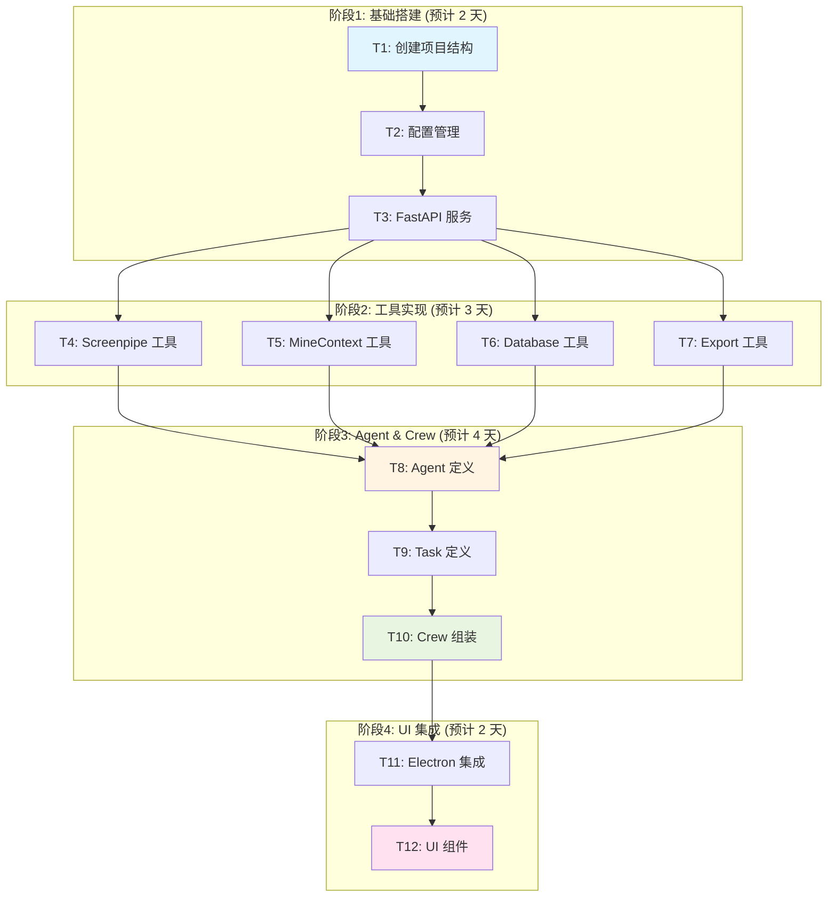

# Phase 3.1 - CrewAI 集成任务分解

**文档版本**: v1.0  
**创建日期**: 2025-11-04  
**阶段**: Atomize (原子化阶段)  
**状态**: ✅ 完成

---

## 📋 任务拆分概览

基于 DESIGN 文档的架构设计，将 Phase 3.1 拆分为 **12 个原子任务**，按依赖关系组织成 **4 个阶段**：



---

## 📦 阶段 1: 基础搭建 (预计 2 天)

### 任务 T1: 创建项目结构

**任务ID**: T1  
**优先级**: P0 (最高)  
**预计时间**: 0.5 天  
**依赖**: 无

#### 输入契约
- 项目根目录: `/Users/ruiwang/Desktop/killer_app`
- 命名: `crewai_service/`

#### 实现内容

1. **创建目录结构**
```bash
cd /Users/ruiwang/Desktop/killer_app
mkdir -p crewai_service/{api,crews,agents,tools,utils,tests}
touch crewai_service/{main.py,config.py,requirements.txt}
touch crewai_service/api/{__init__.py,router.py,schemas.py}
touch crewai_service/crews/{__init__.py,weekly_report.py,crew_manager.py}
touch crewai_service/agents/{__init__.py,researcher.py,analyst.py,writer.py,reviewer.py,exporter.py}
touch crewai_service/tools/{__init__.py,screenpipe_tools.py,minecontext_tools.py,database_tools.py,export_tools.py}
touch crewai_service/utils/{__init__.py,llm_config.py,data_filter.py,logger.py,exceptions.py}
touch crewai_service/tests/{__init__.py,test_agents.py,test_tools.py,test_api.py}
```

2. **创建 requirements.txt**
```txt
# FastAPI
fastapi==0.110.0
uvicorn[standard]==0.27.0
pydantic==2.6.0
pydantic-settings==2.1.0

# CrewAI
crewai==0.28.0
crewai-tools==0.2.0

# LangChain
langchain==0.1.9
langchain-openai==0.0.5

# Utilities
python-multipart==0.0.7
aiofiles==23.2.1
python-dotenv==1.0.1
requests==2.31.0
```

3. **创建 .env.example**
```bash
# LLM Configuration
SILICONFLOW_API_KEY=your_api_key_here
LLM_BASE_URL=https://api.siliconflow.cn/v1
LLM_MODEL=Qwen/Qwen2.5-7B-Instruct

# Service Configuration
HOST=127.0.0.1
PORT=18000

# External Services
SCREENPIPE_URL=http://localhost:3030
MINECONTEXT_URL=http://localhost:17860
```

4. **创建 README.md**
```markdown
# CrewAI Service for MineDesk

Multi-agent workflow service for automated weekly report generation.

## Quick Start

```bash
# Install dependencies
pip install -r requirements.txt

# Configure environment
cp .env.example .env
# Edit .env and add your API key

# Run service
python main.py
```

## API Documentation

Service runs on http://localhost:18000

See `/docs` for interactive API documentation.
```

#### 输出契约
- ✅ 完整的目录结构
- ✅ 所有必需文件已创建
- ✅ README 和 requirements.txt 完整

#### 验收标准
```bash
# 验证目录结构
tree crewai_service -L 2

# 应该看到:
# crewai_service/
# ├── main.py
# ├── config.py
# ├── requirements.txt
# ├── README.md
# ├── .env.example
# ├── api/
# ├── crews/
# ├── agents/
# ├── tools/
# ├── utils/
# └── tests/
```

#### 复杂度
- **技术难度**: ★☆☆☆☆ (简单)
- **工作量**: ★★☆☆☆ (较小)

---

### 任务 T2: 配置管理

**任务ID**: T2  
**优先级**: P0  
**预计时间**: 0.5 天  
**依赖**: T1

#### 输入契约
- T1 创建的目录结构
- DESIGN 文档中的配置规范

#### 实现内容

1. **实现 config.py**
```python
# config.py
import os
from pydantic_settings import BaseSettings
from typing import List

class Settings(BaseSettings):
    # Service Configuration
    HOST: str = "127.0.0.1"
    PORT: int = 18000
    WORKERS: int = 1
    DEBUG: bool = False
    
    # External Services
    SCREENPIPE_URL: str = "http://localhost:3030"
    MINECONTEXT_URL: str = "http://localhost:17860"
    
    # LLM Configuration
    LLM_BASE_URL: str = "https://api.siliconflow.cn/v1"
    SILICONFLOW_API_KEY: str = ""
    LLM_MODEL: str = "Qwen/Qwen2.5-7B-Instruct"
    LLM_TEMPERATURE: float = 0.7
    LLM_MAX_TOKENS: int = 4000
    
    # Database
    DB_PATH: str = "~/Library/Application Support/MineDesk/conversations.db"
    
    # Reports
    REPORTS_DIR: str = "~/MineDesk/reports"
    
    # Data Filtering
    SENSITIVE_KEYWORDS: List[str] = [
        "password", "api_key", "secret", "token",
        "密码", "口令", "秘钥"
    ]
    EXCLUDED_APPS: List[str] = [
        "1Password", "Keychain Access", "Passwords"
    ]
    
    # Performance
    MAX_ACTIVITIES_PER_REQUEST: int = 10000
    REQUEST_TIMEOUT: int = 30
    CREW_MAX_RPM: int = 100
    
    class Config:
        env_file = ".env"
        case_sensitive = True

settings = Settings()
```

2. **实现 utils/logger.py**
```python
import logging
from datetime import datetime
import os

def setup_logger(name: str = "CrewAI Service"):
    """Setup logger with file and console handlers"""
    logger = logging.getLogger(name)
    logger.setLevel(logging.INFO)
    
    # Create logs directory
    log_dir = "logs"
    os.makedirs(log_dir, exist_ok=True)
    
    # File handler
    log_file = os.path.join(
        log_dir,
        f"crewai_service_{datetime.now().strftime('%Y%m%d')}.log"
    )
    file_handler = logging.FileHandler(log_file)
    file_handler.setLevel(logging.INFO)
    
    # Console handler
    console_handler = logging.StreamHandler()
    console_handler.setLevel(logging.INFO)
    
    # Formatter
    formatter = logging.Formatter(
        '%(asctime)s - %(name)s - %(levelname)s - %(message)s'
    )
    file_handler.setFormatter(formatter)
    console_handler.setFormatter(formatter)
    
    logger.addHandler(file_handler)
    logger.addHandler(console_handler)
    
    return logger

logger = setup_logger()
```

3. **实现 utils/exceptions.py**
```python
class CrewAIServiceException(Exception):
    """Base exception for CrewAI Service"""
    pass

class ServiceUnavailableException(CrewAIServiceException):
    """External service unavailable"""
    def __init__(self, service_name: str):
        self.service_name = service_name
        super().__init__(f"{service_name} service is unavailable")

class DataCollectionException(CrewAIServiceException):
    """Error during data collection"""
    pass

class ReportGenerationException(CrewAIServiceException):
    """Error during report generation"""
    pass

class LLMException(CrewAIServiceException):
    """LLM API call failed"""
    pass
```

#### 输出契约
- ✅ `config.py` 实现完整
- ✅ `logger.py` 实现完整
- ✅ `exceptions.py` 实现完整
- ✅ 配置项与 DESIGN 文档一致

#### 验收标准
```python
# 测试配置加载
from config import settings
assert settings.PORT == 18000
assert len(settings.SENSITIVE_KEYWORDS) > 0

# 测试日志
from utils.logger import logger
logger.info("Test log")  # 应该输出到文件和控制台

# 测试异常
from utils.exceptions import ServiceUnavailableException
try:
    raise ServiceUnavailableException("Screenpipe")
except ServiceUnavailableException as e:
    assert "Screenpipe" in str(e)
```

#### 复杂度
- **技术难度**: ★★☆☆☆ (较简单)
- **工作量**: ★★☆☆☆ (较小)

---

### 任务 T3: FastAPI 服务

**任务ID**: T3  
**优先级**: P0  
**预计时间**: 1 天  
**依赖**: T2

#### 输入契约
- T2 的配置管理完成
- DESIGN 文档中的 API 接口规范

#### 实现内容

1. **实现 api/schemas.py**
```python
from pydantic import BaseModel
from typing import Optional, List, Dict, Any
from datetime import datetime

class ReportOptions(BaseModel):
    language: str = "zh"
    include_activities: bool = True
    include_documents: bool = True
    include_conversations: bool = True
    template: str = "default"

class GenerateReportRequest(BaseModel):
    start_date: str  # ISO 8601 format
    end_date: str
    options: Optional[ReportOptions] = ReportOptions()

class ReportMetadata(BaseModel):
    generated_at: str
    duration_seconds: float
    word_count: int
    sections: List[str]

class ReportStatistics(BaseModel):
    total_activities: int
    total_documents: int
    total_time_hours: float
    productivity_score: float

class GenerateReportResponse(BaseModel):
    status: str
    data: Optional[Dict[str, Any]] = None
    message: Optional[str] = None
    error: Optional[Dict[str, Any]] = None

class HealthResponse(BaseModel):
    status: str
    version: str
    services: Dict[str, Any]
    uptime_seconds: float
```

2. **实现 api/router.py**
```python
from fastapi import APIRouter, HTTPException
from api.schemas import *
from crews.crew_manager import CrewManager
from utils.logger import logger
import time

router = APIRouter(prefix="/api")

# Global crew manager instance
crew_manager = CrewManager()

# Service start time
start_time = time.time()

@router.post("/weekly-report/generate", response_model=GenerateReportResponse)
async def generate_report(request: GenerateReportRequest):
    """Generate weekly report using CrewAI agents"""
    try:
        logger.info(f"Generating report: {request.start_date} to {request.end_date}")
        
        # Call crew manager
        result = crew_manager.generate_report(
            start_date=request.start_date,
            end_date=request.end_date,
            options=request.options.dict()
        )
        
        return GenerateReportResponse(
            status="success",
            data=result
        )
    
    except Exception as e:
        logger.error(f"Report generation failed: {e}")
        return GenerateReportResponse(
            status="error",
            message="Failed to generate report",
            error={
                "code": "GENERATION_FAILED",
                "detail": str(e),
                "timestamp": datetime.now().isoformat()
            }
        )

@router.get("/health", response_model=HealthResponse)
async def health_check():
    """Health check endpoint"""
    from config import settings
    import requests
    
    # Check external services
    services = {}
    
    # Check Screenpipe
    try:
        r = requests.get(f"{settings.SCREENPIPE_URL}/health", timeout=3)
        services["screenpipe"] = {
            "available": r.status_code == 200,
            "url": settings.SCREENPIPE_URL
        }
    except:
        services["screenpipe"] = {
            "available": False,
            "url": settings.SCREENPIPE_URL
        }
    
    # Check MineContext
    try:
        r = requests.get(f"{settings.MINECONTEXT_URL}/health", timeout=3)
        services["minecontext"] = {
            "available": r.status_code == 200,
            "url": settings.MINECONTEXT_URL
        }
    except:
        services["minecontext"] = {
            "available": False,
            "url": settings.MINECONTEXT_URL
        }
    
    # LLM check (just verify API key exists)
    services["llm"] = {
        "available": bool(settings.SILICONFLOW_API_KEY),
        "provider": "SiliconFlow",
        "model": settings.LLM_MODEL
    }
    
    return HealthResponse(
        status="healthy",
        version="1.0.0",
        services=services,
        uptime_seconds=time.time() - start_time
    )
```

3. **实现 main.py**
```python
from fastapi import FastAPI
from fastapi.middleware.cors import CORSMiddleware
from api.router import router
from config import settings
from utils.logger import logger
import uvicorn

# Create FastAPI app
app = FastAPI(
    title="CrewAI Service for MineDesk",
    description="Multi-agent workflow service for automated weekly report generation",
    version="1.0.0"
)

# Add CORS middleware
app.add_middleware(
    CORSMiddleware,
    allow_origins=["http://localhost:*"],
    allow_credentials=True,
    allow_methods=["*"],
    allow_headers=["*"],
)

# Include routers
app.include_router(router)

@app.on_event("startup")
async def startup_event():
    logger.info("🚀 CrewAI Service starting...")
    logger.info(f"📍 Service URL: http://{settings.HOST}:{settings.PORT}")
    logger.info(f"📚 API Docs: http://{settings.HOST}:{settings.PORT}/docs")

@app.on_event("shutdown")
async def shutdown_event():
    logger.info("👋 CrewAI Service shutting down...")

@app.get("/")
async def root():
    return {
        "message": "CrewAI Service for MineDesk",
        "version": "1.0.0",
        "docs": "/docs"
    }

if __name__ == "__main__":
    uvicorn.run(
        "main:app",
        host=settings.HOST,
        port=settings.PORT,
        workers=settings.WORKERS,
        reload=settings.DEBUG
    )
```

#### 输出契约
- ✅ FastAPI 服务可启动
- ✅ API 接口定义完整
- ✅ Health check 正常工作
- ✅ CORS 配置正确

#### 验收标准
```bash
# 安装依赖
cd crewai_service
pip install -r requirements.txt

# 启动服务
python main.py

# 测试健康检查
curl http://localhost:18000/api/health

# 访问 API 文档
open http://localhost:18000/docs
```

#### 复杂度
- **技术难度**: ★★★☆☆ (中等)
- **工作量**: ★★★☆☆ (中等)

---

## 📦 阶段 2: 工具实现 (预计 3 天)

### 任务 T4: Screenpipe 工具

**任务ID**: T4  
**优先级**: P0  
**预计时间**: 0.75 天  
**依赖**: T3

#### 输入契约
- T3 的 FastAPI 服务运行
- DESIGN 文档中的 Screenpipe Tools 规范
- Screenpipe API 可用

#### 实现内容

实现 `tools/screenpipe_tools.py`:

```python
from crewai_tools import tool
import requests
from datetime import datetime
from typing import List, Dict, Any
from config import settings
from utils.logger import logger
from utils.exceptions import ServiceUnavailableException
from utils.data_filter import filter_sensitive_activity

@tool("Fetch Screenpipe Activities")
def fetch_screenpipe_activities(start_date: str, end_date: str) -> List[Dict[str, Any]]:
    """
    Fetch desktop activities from Screenpipe for a date range.
    
    Args:
        start_date: ISO 8601 date string (e.g., "2025-10-28")
        end_date: ISO 8601 date string (e.g., "2025-11-04")
    
    Returns:
        List of activity records with timestamps, apps, windows, and OCR text
    """
    try:
        # Convert dates to timestamps
        start_ts = int(datetime.fromisoformat(start_date).timestamp())
        end_ts = int(datetime.fromisoformat(end_date).timestamp())
        
        logger.info(f"Fetching Screenpipe activities: {start_date} to {end_date}")
        
        response = requests.get(
            f"{settings.SCREENPIPE_URL}/search",
            params={
                "start_time": start_ts,
                "end_time": end_ts,
                "limit": settings.MAX_ACTIVITIES_PER_REQUEST
            },
            timeout=settings.REQUEST_TIMEOUT
        )
        
        if response.status_code != 200:
            logger.error(f"Screenpipe API error: {response.status_code}")
            raise ServiceUnavailableException("Screenpipe")
        
        data = response.json()
        activities = data.get("data", [])
        
        logger.info(f"Fetched {len(activities)} activities from Screenpipe")
        
        # Filter sensitive data
        filtered = []
        for activity in activities:
            filtered_activity = filter_sensitive_activity(activity)
            if filtered_activity:  # None means excluded
                filtered.append(filtered_activity)
        
        logger.info(f"Filtered to {len(filtered)} activities (removed sensitive data)")
        
        return filtered
    
    except requests.RequestException as e:
        logger.error(f"Screenpipe connection failed: {e}")
        raise ServiceUnavailableException("Screenpipe")
    
    except Exception as e:
        logger.error(f"Error fetching Screenpipe activities: {e}")
        return []


@tool("Calculate Activity Statistics")
def calculate_time_stats(activities: List[Dict]) -> Dict[str, Any]:
    """
    Calculate time statistics from activities.
    
    Args:
        activities: List of activity records
    
    Returns:
        Dictionary with time distribution statistics
    """
    # TODO: Implement in T4
    pass
```

同时实现 `utils/data_filter.py`:

```python
from config import settings
import re

def filter_sensitive_activity(activity: Dict) -> Dict:
    """Filter sensitive information from activity data"""
    if not activity:
        return None
    
    filtered = activity.copy()
    
    # Exclude activities from sensitive apps
    if filtered.get('app') in settings.EXCLUDED_APPS:
        return None
    
    # Filter OCR text
    if 'ocr_text' in filtered and filtered['ocr_text']:
        filtered['ocr_text'] = filter_sensitive_text(filtered['ocr_text'])
    
    # Filter window titles
    if 'window' in filtered and filtered['window']:
        filtered['window'] = filter_sensitive_text(filtered['window'])
    
    return filtered

def filter_sensitive_text(text: str) -> str:
    """Replace sensitive keywords with [REDACTED]"""
    if not text:
        return text
    
    filtered = text
    for keyword in settings.SENSITIVE_KEYWORDS:
        if keyword.lower() in filtered.lower():
            pattern = re.compile(re.escape(keyword), re.IGNORECASE)
            filtered = pattern.sub("[REDACTED]", filtered)
    
    return filtered
```

#### 输出契约
- ✅ `fetch_screenpipe_activities` 工具实现
- ✅ `calculate_time_stats` 工具实现
- ✅ 数据过滤正常工作
- ✅ 敏感信息被正确屏蔽

#### 验收标准
```python
# 单元测试
from tools.screenpipe_tools import fetch_screenpipe_activities, calculate_time_stats

# Test fetch
activities = fetch_screenpipe_activities("2025-11-01", "2025-11-04")
assert isinstance(activities, list)
assert len(activities) > 0

# Test sensitive data filtering
test_activity = {
    "app": "Chrome",
    "window": "password manager",
    "ocr_text": "my api_key is secret123"
}
from utils.data_filter import filter_sensitive_activity
filtered = filter_sensitive_activity(test_activity)
assert "[REDACTED]" in filtered["window"]
assert "[REDACTED]" in filtered["ocr_text"]
```

#### 复杂度
- **技术难度**: ★★★☆☆ (中等)
- **工作量**: ★★★☆☆ (中等)

---

### 任务 T5-T7: MineContext、Database、Export 工具

这三个任务的结构类似于 T4，具体实现内容省略。每个任务：

**T5: MineContext 工具** (0.75 天)
- 实现 `search_documents` 工具
- 实现 `get_context` 工具

**T6: Database 工具** (0.75 天)
- 实现 `fetch_conversations` 工具
- SQLite 数据库访问

**T7: Export 工具** (0.75 天)
- 实现 `save_markdown` 工具
- 文件系统操作

---

## 📦 阶段 3: Agent & Crew (预计 4 天)

### 任务 T8: Agent 定义

**任务ID**: T8  
**优先级**: P0  
**预计时间**: 2 天  
**依赖**: T4, T5, T6, T7

#### 实现内容

实现 5 个 Agent 文件：
1. `agents/researcher.py` - Data Researcher
2. `agents/analyst.py` - Data Analyst
3. `agents/writer.py` - Content Writer
4. `agents/reviewer.py` - Quality Reviewer
5. `agents/exporter.py` - Export Manager

每个 Agent 按照 DESIGN 文档的规范实现。

#### 复杂度
- **技术难度**: ★★★★☆ (较难)
- **工作量**: ★★★★☆ (大)

---

### 任务 T9: Task 定义

**任务ID**: T9  
**优先级**: P0  
**预计时间**: 1 天  
**依赖**: T8

#### 实现内容

在 `crews/weekly_report.py` 中定义 5 个 Task，按照 DESIGN 文档的 Task 规范实现。

#### 复杂度
- **技术难度**: ★★★☆☆ (中等)
- **工作量**: ★★★☆☆ (中等)

---

### 任务 T10: Crew 组装

**任务ID**: T10  
**优先级**: P0  
**预计时间**: 1 天  
**依赖**: T9

#### 实现内容

1. 实现 `crews/weekly_report.py` - Crew 定义
2. 实现 `crews/crew_manager.py` - Crew 管理器

#### 复杂度
- **技术难度**: ★★★★☆ (较难)
- **工作量**: ★★★☆☆ (中等)

---

## 📦 阶段 4: UI 集成 (预计 2 天)

### 任务 T11: Electron 集成

**任务ID**: T11  
**优先级**: P0  
**预计时间**: 1 天  
**依赖**: T10

#### 输入契约
- T10 的 CrewAI 服务正常运行
- MineDesk Electron 应用可访问

#### 实现内容

1. **创建 CrewAI 服务层** (`minedesk/src/main/services/CrewAIService.ts`):

```typescript
import axios, { AxiosInstance } from 'axios'

interface GenerateReportRequest {
  start_date: string
  end_date: string
  options?: {
    language?: 'zh' | 'en'
    include_activities?: boolean
    include_documents?: boolean
    include_conversations?: boolean
    template?: 'default' | 'detailed' | 'simple'
  }
}

interface GenerateReportResponse {
  status: 'success' | 'error'
  data?: {
    report_id: string
    content: string
    metadata: any
    statistics: any
  }
  message?: string
  error?: any
}

class CrewAIService {
  private client: AxiosInstance
  private baseUrl: string

  constructor(baseUrl: string = 'http://localhost:18000') {
    this.baseUrl = baseUrl
    this.client = axios.create({
      baseURL: baseUrl,
      timeout: 120000  // 2 minutes
    })
  }

  async checkAvailability(): Promise<boolean> {
    try {
      const response = await this.client.get('/api/health')
      return response.status === 200
    } catch {
      return false
    }
  }

  async getStatus() {
    const available = await this.checkAvailability()
    return {
      available,
      url: this.baseUrl
    }
  }

  async generateReport(request: GenerateReportRequest): Promise<GenerateReportResponse> {
    try {
      const response = await this.client.post<GenerateReportResponse>(
        '/api/weekly-report/generate',
        request
      )
      return response.data
    } catch (error: any) {
      throw new Error(`CrewAI API error: ${error.message}`)
    }
  }
}

export default new CrewAIService()
```

2. **添加 IPC Handler** (`minedesk/src/main/ipc/index.ts`):

```typescript
// 在现有的 setupIpcHandlers 函数中添加

import crewaiService from '../services/CrewAIService'

// CrewAI IPC handlers
ipcMain.handle('crewai:get-status', async () => {
  try {
    return await crewaiService.getStatus()
  } catch (error: any) {
    console.error('IPC crewai:get-status error:', error)
    throw error
  }
})

ipcMain.handle('crewai:generate-report', async (_event, request) => {
  try {
    return await crewaiService.generateReport(request)
  } catch (error: any) {
    console.error('IPC crewai:generate-report error:', error)
    throw error
  }
})
```

3. **更新 Preload API** (`minedesk/src/preload/index.ts`):

```typescript
const api = {
  // ... existing APIs ...
  
  // CrewAI API
  crewai: {
    getStatus: () => ipcRenderer.invoke('crewai:get-status'),
    generateReport: (request: any) =>
      ipcRenderer.invoke('crewai:generate-report', request)
  }
}
```

#### 输出契约
- ✅ CrewAI 服务层实现
- ✅ IPC Handler 添加
- ✅ Preload API 暴露

#### 验收标准
```typescript
// 测试服务可用性
const status = await window.api.crewai.getStatus()
console.log(status.available)  // true

// 测试生成周报
const report = await window.api.crewai.generateReport({
  start_date: '2025-10-28',
  end_date: '2025-11-04'
})
console.log(report.data.content)
```

#### 复杂度
- **技术难度**: ★★★☆☆ (中等)
- **工作量**: ★★★☆☆ (中等)

---

### 任务 T12: UI 组件

**任务ID**: T12  
**优先级**: P0  
**预计时间**: 1 天  
**依赖**: T11

#### 输入契约
- T11 的 Electron 集成完成
- IPC 通信正常工作

#### 实现内容

1. **创建 WeeklyReport 组件** (`minedesk/src/renderer/src/components/WeeklyReport/index.tsx`):

```typescript
import { useState } from 'react'
import ReactMarkdown from 'react-markdown'

export function WeeklyReport() {
  const [loading, setLoading] = useState(false)
  const [report, setReport] = useState<string | null>(null)
  const [error, setError] = useState<string | null>(null)

  const handleGenerate = async () => {
    setLoading(true)
    setError(null)
    
    try {
      // Calculate date range (last 7 days)
      const endDate = new Date()
      const startDate = new Date()
      startDate.setDate(endDate.getDate() - 7)
      
      const response = await window.api.crewai.generateReport({
        start_date: startDate.toISOString().split('T')[0],
        end_date: endDate.toISOString().split('T')[0],
        options: {
          language: 'zh',
          include_activities: true,
          include_documents: true,
          include_conversations: true
        }
      })
      
      if (response.status === 'success') {
        setReport(response.data.content)
      } else {
        setError(response.message || 'Failed to generate report')
      }
    } catch (err: any) {
      setError(err.message)
    } finally {
      setLoading(false)
    }
  }

  return (
    <div className="weekly-report">
      <div className="header">
        <h2>📊 Weekly Report</h2>
        <button 
          onClick={handleGenerate}
          disabled={loading}
          className="generate-button"
        >
          {loading ? 'Generating...' : 'Generate Report'}
        </button>
      </div>
      
      {loading && (
        <div className="loading">
          <div className="spinner" />
          <p>Generating your weekly report...</p>
          <p className="text-sm">This may take up to 2 minutes</p>
        </div>
      )}
      
      {error && (
        <div className="error">
          <p>❌ Error: {error}</p>
        </div>
      )}
      
      {report && (
        <div className="report-content">
          <ReactMarkdown>{report}</ReactMarkdown>
        </div>
      )}
    </div>
  )
}
```

2. **将组件集成到主界面**

#### 输出契约
- ✅ WeeklyReport 组件实现
- ✅ UI 交互流畅
- ✅ Markdown 渲染正常
- ✅ 错误处理完善

#### 验收标准
- 用户点击按钮后显示加载状态
- 2 分钟内生成周报
- 周报以 Markdown 渲染展示
- 错误信息友好提示

#### 复杂度
- **技术难度**: ★★★☆☆ (中等)
- **工作量**: ★★★☆☆ (中等)

---

## 📊 任务统计

### 按优先级

| 优先级 | 任务数 | 任务列表 |
|--------|--------|----------|
| P0 (最高) | 12 | T1-T12 |
| P1 (高) | 0 | - |
| P2 (中) | 0 | - |

### 按复杂度

| 难度 | 任务数 | 预计时间 |
|------|--------|----------|
| ★☆☆☆☆ | 1 | 0.5 天 |
| ★★☆☆☆ | 2 | 1 天 |
| ★★★☆☆ | 7 | 8.5 天 |
| ★★★★☆ | 2 | 3 天 |
| ★★★★★ | 0 | 0 天 |

**总计**: 13 天 (考虑并行和调试，实际约 11-16 天)

---

## 🎯 关键路径

```
T1 → T2 → T3 → [T4, T5, T6, T7] → T8 → T9 → T10 → T11 → T12
```

**关键任务**:
1. T3 - FastAPI 服务 (阻塞所有工具实现)
2. T8 - Agent 定义 (最复杂)
3. T10 - Crew 组装 (核心逻辑)
4. T12 - UI 组件 (用户可见)

---

## ✅ 整体质量门控

### 代码质量
- [ ] TypeScript 类型检查 0 错误
- [ ] Python 代码符合 PEP 8
- [ ] ESLint 检查通过
- [ ] 所有函数有类型注解

### 测试覆盖
- [ ] 单元测试覆盖率 > 70%
- [ ] API 接口测试完整
- [ ] Agent 工具测试通过
- [ ] E2E 测试通过

### 文档完善
- [ ] 所有 API 有文档
- [ ] README 完整
- [ ] 代码注释清晰
- [ ] 用户指南完整

---

## 🚀 下一步

**Atomize 阶段已完成** ✅

接下来进入 **Approve 阶段**，需要：
1. 人工审查所有任务定义
2. 确认技术可行性
3. 评估风险和复杂度
4. 批准进入实施

---

**文档状态**: ✅ 已完成  
**更新时间**: 2025-11-04  
**任务拆分者**: AI Assistant  
**待审核**: 是

